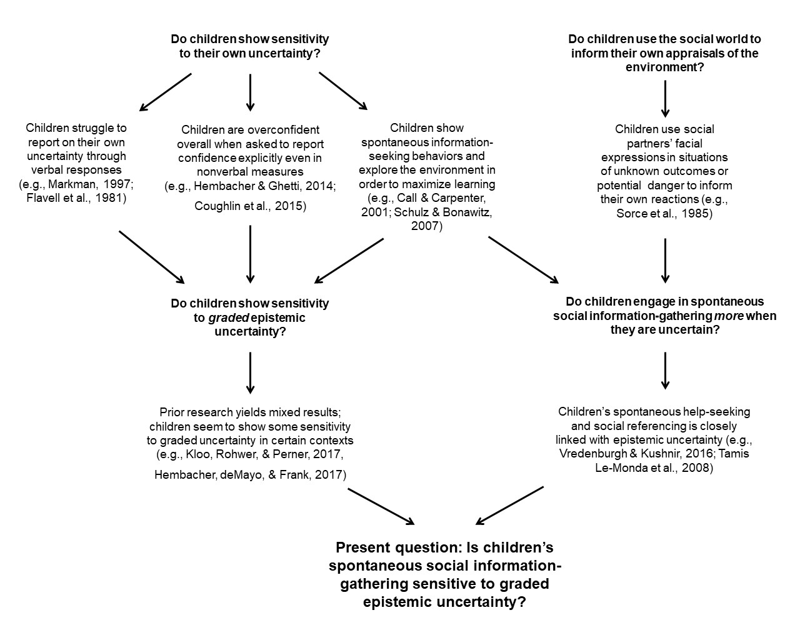

```{r load_packages, include = FALSE}
library("papaja")
library(psych)
library(langcog)
library(tidyverse)
library(stringr)
library(magrittr)
library(lmerTest)


example_file <- "../raw_data/020218_01-eye_data Samples.txt"

example_trial_file <- "../trial_data/020218_01.csv"

demographics_sheet <- "../soc_ref_cat_demo_github.csv"

key <- "../trial_morphs.csv"

experiment_setup_path <- "../images/setup.jpg"

stimulus_objects_a <- "..images/setAstimuli.png"

```

```{r analysis_preferences}
# Seed for random number generation
set.seed(42)
```

Early in life, children are presented with a great deal of social information from which they can learn about the world around them. They overhear conversations, are spoken to directly, and interact with other people nonverbally.  But when do they actively seek out information from their social partners? Specifically, do children "know what they don't know" well enough to seek information on the basis of their own subjective uncertainty, or do they learn more often by passively absorbing information from other people? 

While it may seem intuitive that a child will seek help from a conversational partner when they lack enough information to make a decision, the questions posed above are non-trivial. Prior research which shows that children actively explore their environments and guide their own learning processes [e.g., @schulz2007serious] is somewhat at odds with a separate body of research that highlights young children's deficits when it comes to monitoring their own knowledge states and acting on their own uncertainty [e.g., @markman1977realizing]. In light of this apparent tension, the current study seeks to better understand to what degree children's information-gathering behaviors -- in this case, gaze to a knowledgeable social partner -- are driven by the child's epistemic uncertainty. Building on prior work that suggests that children's social gaze may be a sensitive measure of epistemic uncertainty [@hembacherchildren], this study uses a categorization task to examine whether children's social information-gathering behaviors are modulated by graded uncertainty.

Below, I review prior research that demonstrates children's capacities to engage in the various preqrequisite behaviors that are necessary to show selective social information-seeking on the basis of graded uncertainty. I begin by outlining research on children's metacognitive development which, due to its reliance on verbal and/or explicit responses from children, may have underestimated children's uncertainty monitoring capacities. Secondly, I discuss more recent work, which has established that children spontaneously seek information, and that they do it *selectively*, indicating that this information-seeking serves the specific purpose of filling in gaps in uncertainty and maximizing the child's learning about the world. I then review work pertaining to children's referencing of social partners in situations of uncertain outcomes, potential danger, and epistemic uncertainty, and cite prior work that demonstrates that children show some patterns of selectivity in how they sample information from the social world. Finally, I review research concerning children's sensitivity - or potentially, lack thereof - towards graded uncertainty, and describe my study designed to understand more about children's social information-seeking behaviors under conditions of graded uncertainty.

```{r schematic, fig.align="center", fig.cap="Schematic representation of theoretical background and prior research informing the current study."}



```

##Uncertainty Monitoring and Active Learning in Early Childhood

Prior work on children's uncertainty monitoring has yielded mixed evidence as to whether young children can successfully recognize when they lack information and subsequently act on this knowledge of their own ignorance to make a decision [@sodian2012metacognition].  Early studies investigating metacognitive development indicated that children's competence in assessing and acting on their own epistemic ignorance is limited. Markman [-@markman1977realizing] explained a card game to first and third grade children with ambiguous language such that understanding the object of the game was impossible without seeking clarification. An experimenter then prompted the child to seek this clarification with scripted statements such as "What do you think?", "Do you have any questions?" and "Did I tell you everything you need to know to play the game?" In this study, Markman found that the younger children required more prompts before seeking out additional information, which she argues is an indication that young elementary school children do not engage in "constructive processing". That is, they process the instructions being given by the experimenter superficially without simulating trying to execute them, and are consequently unaware of gaps in their own knowledge. 

Similarly, Flavell, Speer, Green, August, & Whitehurst [-@flavell1981development] asked kindergarten and second-grade children to reconstruct block structures built by a confederate based on a tape of instructions from the confederate, which were not sufficiently clear to successfully recreate the structure.  The researchers found that older children were more likely to indicate the need for additional clarifying information by replaying the tape, asking questions explicitly, or generally looking puzzled. Conversely, kindergarteners typically did not display these behaviors. This result demonstrated that older children were more adept at seeking information explicitly, but it also showed that younger children were less likely to spontaneously seek information from the environment (for example, by replaying the tape). 

Rather than measure children's spontaneous information-seeking behaviors, some more recent research has gauged children's uncertainty monitoring capacities by asking them to report on their decision confidence in various contexts. When asked to report confidence in their answers on a memory task, 3-year-olds were equally confident about correct and incorrect responses, while 4- and 5-year-olds showed a more adult-like pattern of lower confidence for incorrect responses [@hembacher2014don]. In a perceptual identification task, 3- to 5-year-olds reported being less confident when they provided incorrect responses, although overall they were still overconfident [@coughlin2015introspection]. In order to avoid requiring a verbal response from children, which may obscure children's capacity to reflect on their own ignorance, these studies used a pictorial confidence scale when prompting children to report on their uncertainty. However, the possibility exists that even these studies underestimate children's ability to monitor their own uncertainty because they require children to explicitly report their confidence (even if not in an open-ended verbal response), and that children can act on their own uncertainty before they can communicate it through explicit responses or reflect on it consciously. Thus, although these studies did not hinge on an verbal report of uncertainty from children (which may be the most difficult response for a child to provide), they still required children to explicitly report on their confidence - a measure of uncertainty which may be still more difficult than more implicit, spontaneous and action-based measures.

## Children's Spontaneous Information-seeking Behaviors

In contrast to the explicit confidence measurements used in the studies discussed above, some research has shown that children engage in spontaneous information-gathering behaviors -- that is, behaviors that are not prompted explicitly by an experimenter -- more often when they are faced with uncertainty. These studies demonstrate that children engage in *active learning*, in which the learner decides what information they want to be exposed to, rather than having the decision made for them by a teacher [@gureckis2012self]. While early research on children's metacognitive development also measured unprompted information-seeking behaviors and found that younger children do not engage in spontaneous information-seeking, these early studies often required an explicit verbal response from children, as in Markman [-@markman1977realizing]. Furthermore, studies such as Flavell, et al. [-@flavell1981development] showed children's deficit in realizing when instructions are insufficient, which may be more difficult for children than realizing they lack other types of knowledge, such as memory of an event. Specifically, it may be particulary difficult for children to realize they lack understanding or knowledge of instructions, since doing so requires that children realize that they may encounter an obstacle in the future that may not be immediately apparent to them at the moment the instructions are given. 

Recent research which at least partially alleviated these task demands has found evidence of children's engagement in spontaneous information-seeking. In one study, when 2-year-old children were asked to find a sticker hidden inside of one of several tubes, they peeked inside the tubes more when they had not seen the experimenter place the sticker, indicating that they spontaneously sought out more information when deprived of sufficient information to make a decision [@call2001apes]. In another study, young children were shown a group of toys that either differed in their color or in how they felt to the touch [@robinson2008children]. All of the toys were put into a bag by the experimenter, who mixed them up and then picked out a toy. In the condition where the experimenter put the toy on the table and ask the child, "Which one is it?", children more often reached out and touched the toy more when its distinctive quality was texture than when it was color. In contrast, when the experimenter handed the object to the child, thus giving the child visual and tactile access to the toy simultaneously, children still correctly were able to identify whether the toy was soft or hard, but unable to accurately report that they had arrived at this conclusion by touching the toy. Thus, in this particular context, children interact with the environment using sensory modalities that will most effectively fill in gaps in uncertainty, even if they are unable to explicitly report doing so.  

Schulz and Bonawitz [-@schulz2007serious] also found that when young children were presented with a causally-confounded toy (i.e., a toy that exhibited a behavior whose causal structure could not be deduced) and could choose between playing with that toy or a novel toy, they chose to further explore the causally-confounded toy. However, when the choice was between continuing to play with a causally-unconfounded toy and playing with a new toy, children preferred the novelty of exploring the new toy, demonstrating that children play spontaneously in order to maximize learning based on uncertainty about the world. Goupil & Kouider [-@goupil2016infants] found that even preverbal infants faced with an object-retrieval task persisted on their answers more when they were correct than incorrect, showing that children are sensitive to their own likely accuracy and flexibly adjust their actions accordingly. 

##Children's Social Referencing and Social-Information Gathering

Taken together, these studies provide compelling evidence that children choose to seek more information specifically to resolve uncertainty, and that they sample sources of evidence that are most likely to provide disambiguating information. In this study, I examine the selectivity of children's spontaneous sampling social information. In order to do this, children must consider other people to be helpful sources of information. 

Evidence in a number of experimental contexts suggests that infants and young children reference trusted adults for disambiguating information in situations of uncertain outcomes and potential danger.  Sorce, Emde, Campos, and Klinnert [-@sorce1985maternal] showed that infants look to their mothers to determine whether it is safe to proceed crawling over a "visual-cliff", a glass table that is actually safe to walk on but which looks like a daunting drop-off to an infant. When infants' caregivers showed an encouraging expression, infants tended to crawl onto the glass surface, whereas they avoided doing so when their mother showed a frightened facial expression. Other studies have shown that children use caregivers' emotional appraisals of novel toys [@klinnert1981infants; @feinman1982social; @hornik1987effects] and recently-met strangers[@feinman1983social] to inform how they interact with newly-encountered aspects of their environments. 

The above studies provide strong evidence that children, starting in the early stages of infancy, use others' appraisals of the world around them to resolve uncertainty about the safety or physical affordances of the environment. Specifically, they use information gleaned by looking at their social partners' faces to guide their own actions. Children, beginning in infancy, also reference speakers' gaze in order to determine the referent of a utterance, suggesting that looking to others' faces is a critical form of minimal infomation-seeking in early childhood [@baldwin1991infants]. However, there is only limited prior research that sheds light on whether children's searches for social information are driven by gaps in the child's knowledge and their own awareness of these gaps. 

There are several reasons to suspect that children may be less selective with their social information-seeking than they are with information-seeking in non-social contexts. Some forms of social information-seeking, such as looking at others' faces, may be less costly than other forms of manual exploration of the environment such as tactile play, in that they may require less time and cognitive resources. Additionally, social information may be sufficiently salient such that children sample it regardless of the uncertainty associated with a particular situation. This possibility is plausible given research which demonstrates that children focus more attention to faces and other socially informative aspects of complex scenes beginning as early as preverbal infancy [@frank2009development; @frank2012measuring]. Nevertheless, prior research has shown that children show selectivity in some of their social information-gathering behaviors. Below, I review studies that demonstrate that children are selective when choosing their informants, and that they more heavily weight social information in situations of uncertainty.

##Selective trust in testimony

A large body of evidence suggests that young children are selective social learners in terms of whom they choose as their informants. Younger children tend to use an informant's familiarity as a cue to the trustworthiness of the information being offered, but children gradually shift to depend more on an informant's demonstrated competence and expertise as they grow older [@corriveau2009choosing; @lucas2013social]. In one study, children were found to generally be proficient at tracking the accuracy of an informant's information when explicitly probed. Furthermore, children who showed this proficiency selectively learned novel object labels from an accurate informant, while those who failed to discriminate between an accurate and inaccurate informant likewise did not selectively use information from the accurate informant [@koenig2004trust].  Children also show selective learning from an informant who appears uncertain versus one who is clearly knowledgeable, and are able to assess someone else's knowledge on a particular topic beyond perceptual cues such as facial expression [@sabbagh2001learning]. Taken together, these studies show that children, beginning in the preschool years, choose their information sources in order to maximize knowledge gain. However, it remains unclear whether children are similarly selective in their social information-gathering depending on their own level of epistemic ignorance.

##Selective social learning on the basis of uncertainty

Despite young children's apparent lack of ability to explicitly report their own uncertainty, a few studies indicate that young children may seek and use information selectively from other people on the basis of epistemic uncertainty. Tamis-LeMonda et al. [-@tamis2008infants] extended the finding of Sorce et al. [-@sorce1985maternal] in order to determine whether children consider the expressions of their caregivers more when the safety of the environment is more uncertain versus when it is completely certain. In this study, researchers tested whether 18-month-old infants would walk down slopes of varying risk levels when given either encouraging or discouraging signals from their mothers.  The researchers found that children tended to ignore their mothers' encouraging messages when faced with a slope that was clearly too steep to walk down safely, and similarly ignored mothers' discouraging messages when the slope was obviously safe. At borderline slopes, when it was unclear to infants whether the slope was safe to walk down or not, children tended to comply much more consistently with the encouragement or discouragement provided by mother, showing that even  infants selectively give more weight to social information when perceptual input is not enough to make a decision. 

While the study by Tamis-LeMonda et al. examined children's selective integration of social information, it did not include children's sampling (e.g., through gaze shifts) of social information as a dependent measure. Some recent research has begun to address the question of whether children actively seek out information from their social partners when uncertainty is high. Vredenburgh and Kushnir [-@vredenburgh2016young] investigated children's propensity to ask questions when faced with toy-assembly tasks of differential levels of difficulty. They found that preschoolers were significantly more likely to ask an experimenter for help on tasks that were more difficult for them, indicating that children adjust their social information-gathering behavior to optimize their learning. Another study examined whether infants selectively reference their social partners' gaze when their social partners has uttered an ambiguous object label [@vaish2011thirteen]. In this study, infants heard an experimenter produce a novel label when there were either two or one single objects present. Infants looked up more at the experimenter when there were two objects present and the referent of the experimenter's label was thus ambiguous. 

A later study by Hembacher, deMayo, and Frank (2017) sought to replicate and extend the finding of Vaish et al. with preschool-aged children. In this study, children aged 2 - 5 were presented with either one or two objects, heard a label produced by the experimenter, and asked to put the labeled item in a bucket. The number of objects (1 vs. 2) and their familiarity to the child were varied to manipulate referential ambiguity. Across two experiments, they found that children looked up at the experimenter more as they were making their choice when referential ambiguity was present. Specifically, children did the most looking at the experimenter when both objects were novel, did the least looking when both objects were familiar, and did an intermediate amount when one of the objects was familiar and one was novel. Additionally, when helpful gaze from the experimenter was included as a between-subjects manipulation, children looked up at the experimenter more when one object was familiar and one was novel, but only when helpful gaze was absent, suggesting that children's social referencing might be sensitive to graded levels of epistemic uncertainty. Thus, children are not only sensitive to states of complete ignorance and complete knowledge, but may also be sensitive to intermediate levels of evidence for a hypothesis. 

##Sensitivity to graded uncertainty

Although these results provide initial evidence that children seek social information on the basis of graded uncertainty, this study did not manipulate ambiguity in a continuous fashion, but rather presented children with only one intermediate level of uncertainty between complete certainty and complete ambiguity. In many learning contexts (i.e., category learning) many more degrees of ambiguity exist than complete certainty and complete ambiguity. 

It is unclear whether young children are sensitive to intermediate levels of epistemic uncertainty, but some research suggests that their capacity to monitor graded uncertainty may be limited. Morgan, Laland and Harris [-@morgan2015development] asked children between the ages of 3 and 7 to determine which of two illustrated quantities was bigger; on some trials, the quantities were more similar to each other (i.e., the task was more difficult) than in other trials. After receiving feedback on their choice, children could either stick with their initial answer or change it.  Children of all ages in the study seemed to be generally insensitive to their own uncertainty, evidenced by the fact that they tended to stick with their original answers regardless of the initial difficulty of the task. A possible explanation for this result is that children may have more trouble showing sensitivity to graded uncertainty when doing so requires that they break from a decision they already committed to, as compared to engaging in other forms of spontaneous information-seeking.

Another body of research has shown that children over the age of 3 can report on states of complete ignorance or complete knowledge when asked about an object that is being hidden [e.g., @wimmer1988children], meaning that when they are asked if they know which object has been hidden, they can accurately report on their own knowledge state if they have seen the hiding event (complete certainty) or have not seen any objects at all (complete ignorance). However, children of the same age struggle in *partial exposure tasks*, in which they are shown two objects and told one of them will be hidden, but are not able to see which one ends up being hidden [@kloo2012development; @sodian1987children]. In these situations, children tend to erroneously report that they know which object has been hidden, even though they had no visual access to the hiding event.  Some studies, however, show that children as young as 2 or 3 years old engage in spontaneous information-seeking when faced with ambiguity in partial exposure tasks [@call2001apes; @kloo2017direct]. 

In sum, while 3 to 6-year-old children struggle to demonstrate explicit or verbal reasoning about their own ignorance in partial exposure tasks, some studies show that children may engage in spontaneous information-gathering when they lack sufficient knowledge to make a decision. This prior research leaves open the question of whether children engage in selective social-information gathering that reflects a sensitivity to graded uncertainty. 

##Current Study

Building off the findings discussed above, the current study was uses a categorization paradigm to determine whether children's social information-gathering is driven by graded uncertainty. Children completed a category discrimination game in which they were introduced to two creatures, and told that each creature had a specific box that it was supposed to live in. They were then handed a number of images depicting creatures at various points on the perceptual continuum between the two prototype images to which they had initially been exposed, and were asked to put each creature in its correct box. The critical dependent measure was the duration of children's looks to the experimenter seated across the table from them, which I measured with an SMI RED-n eye-tracker. I predicted that children would look longer to the experimenter when attempting to categorize stimuli closer to the center of the perceptual continuum. This design allowed me to examine the degree to which children's social referencing is sensitive to graded uncertainty.

A categorization task was used here in part because category learning is a critical learning context in early childhood. Young children possess many mechanisms that facilitate category learning, including sensitivity to statistical regularities in the environment [@saffran1996statistical], sensitivity towards correlations of shared attributes among objects [@younger1985segregation], and acute attention to perceptual features such as shape [@imai1994children]. Selectively seeking social information on the basis of graded uncertainty could be another such mechanism that aids in children's category learning.  It is an open question whether children seek out disambiguating evidence when there is less evidence for an object's category membership.

In this study, I introduced children to two different types of "imaginary creatures" based on stimuli created by Havy and Waxman [-@havy2016naming]. These stimuli sets consisted of two different perceptual continua, such that an image's category identity was more ambiguous as the center of the perceptual continuum is approached. I then asked children to categorize each image. I was interested in whether children's looks to the experimenter would reflect graded levels of category uncertainty, such that children would spend more time looking at the experimenter when the target creature was closer to the center of continuum. I predicted that children's looking would show this pattern.  

Eye-tracking technology was used in this study to allow me to measure the duration of children's looks to the experimenter with greater precision than that afforded by hand-coding. Typically, research in social cognition that uses eye-tracking (particularly when it involves children) measures children's gaze patterns on a digital stimulus display such as a television screen which shows still or moving images  [@gredeback2009eye]. This is partially due to the fact that live-eye tracking with both children and adults is more difficult than conventional eye-tracking displays which use a digital stimulus display. Nevertheless, some research suggests that social looking behaviors may differ slightly when a participant is engaged in a real social interaction as opposed to viewing a screen image of the same interaction [@risko2012social].  One study in particular suggests that merely the potential for social interaction that exists with a live partner draws social gaze more than video images of the same social partner [@laidlaw2011potential]. A separate line of research also shows that children learn more effectively when interacting with a social partner whose actions are contingent on the child's actions, as compared to watching a video of a person acting as a teacher [@troseth2006young; @roseberry2014skype]. As a result, it may be that children shift gaze to a socially contingent partner in a different way than they would to a prerecorded social partner who does not actually interact with the child.

Despite the methodological challenges associated with live eye tracking, its use with children and infants is not unprecedented. This technique has mostly been used to examine social gaze irregularities in children with Autism Spectrum Disorder (ASD), and has been used with children of preschool and primary school age [@noris2012investigating; @falck2015eye; @nadig2010does]. At least one study has also extended this type of eye-tracking to typically-developing infants. Gredeback, Fikke, and Melinder examined the development of infants' gaze-following behaviors between 2 and 8 months and using a live eye-tracking paradigm (-@gredeback2010development). In this study, infants began showing gaze-following behaviors between 2 to 4 months of age, and were more likely to follow the gaze of a stranger than the gaze of their mother. 

In sum, since prior research indicated that such a live eye-tracking approach was possible, and since using an eye tracker decreases the potential for human error involved in hand-coding, I used an eye-tracking setup to measure gaze shifts to an in-person social partner. 


# Methods

## Pilot Testing
I developed the experimental procedure descibed below over a 5-week pilot testing period. During this period, I recruited 40 child participants at the Children's Discovery Museum in San Jose, CA who participated in various preliminary versions of the task. The primary purpose of pilot testing was to arrive at a version of the test that (a) showed levels of accuracy on the task that indicated differential levels of uncertainty for children during the task, and (b) kept children engaged and was enjoyable to them. Several facets of the experimental design were adjusted throughout the pilot-testing process, including the color of the stimuli, the number of trials, the presenation of motivational rewards (stickers) throughout the task, and whether children had visual access to prototype images of stimuli they were being asked to categorized.

```{r include=FALSE}
# Read in trial data.

demographics <- read_csv(demographics_sheet)
include <- 
  demographics %>% 
  filter(Exclude == "n") 

trial_key <- read_csv(key)

d_trials <- data_frame()
files <- dir("../trial_data")

for (f in files) {
  
  subj_id <- str_replace(f, ".csv", "")
  
  condition <- 
    demographics %>% 
    filter(`SID` == subj_id) %>% 
    pull("Condition")

  jf <- paste("../trial_data/", f, sep = "")
  jd <- read_csv(jf)
  id <- 
    tibble(
      SID = subj_id, 
      trial = jd$Trial.Number,  
      onset = jd$Trial.onset / 1000,  
      offset = jd$Trial.offset / 1000,
      chosen_side = jd$Trial.side
    ) %>%
    mutate(
      camera_onset = jd$camera.onset[1] / 1000,
      webcam_onset = jd$webcam.onset[1] / 1000,
      camera_lag = webcam_onset - camera_onset,
      webcam_length = jd$extcam_length.onset[1] / 1000,
      onset = onset + camera_lag,
      offset = offset + camera_lag

    )
  d_trials <- bind_rows(d_trials, id)
  
}

d_trials <- 
  d_trials  %>%
  left_join(
    demographics %>% select(SID, Condition),
    by = c("SID")
  ) %>%
  left_join(
    trial_key,
    by = c("trial" = "Trial", "Condition")
  ) %>%
  mutate(
    accuracy = case_when(
       correct_side == "M" ~ NA,
       correct_side != "M" ~ correct_side == chosen_side
    )
   ) %>%
  left_join(
    demographics %>% select(SID, age),
    by = "SID"
  )

mean_age <- 
  demographics %>% 
  filter(`Exclude` == "n") %>% 
  pull(age) %>% 
  mean()
```

## Participants
I recruited a sample of 30 children aged 3 to 5 years (mean age = `r mean_age`) at the Bing Nursery School at Stanford University in Stanford, CA. Children were asked by the experimenter if they wanted to play a short game during their regularly scheduled free-play. Children were predominantly white and Asian and generally had highly-educated parents. All children were tested by the same experimenter and were randomly assigned to one of four counterbalance conditions.

## Stimuli, Design and Procedure

```{r stimuli, fig.align="center", fig.cap="Stimulus sets provided to children. Images on the ends of the spectrums are prototypes which morph into each other an a perceptual continuum."}

knitr::include_graphics("../images/stimuli.png")

```

### a) Stimuli.
Stimuli were slightly altered versions of those created by Havy and Waxman (2016). Havy and Waxman created their stimulus sets by rendering two novel prototype images and using Norrkross MorphX to create a perceptual continuum of stimulus items that were different morph combinations of the two prototypes. Since pilot testing revealed that the current task was too easy for children when the prototypes varied in color, I transformed them to be monochromatic blue (Figure \ref{fig:stimuli}).  The images were printed and laminated to make rectangular cards that children could insert into one of the two boxes.

### b) Experimental Setup and Eye-tracking Mechanism.

```{r setup, fig.height=6, fig.width=8, fig.cap="Experimental setup from child's perspective. The eye-tracker across the table recorded gaze shifts to the experimenter throughout the task."}


```

Children were seated in a small chair in front of a table which contained two boxes, one red and one green, both placed within their reach (Figure \ref{fig:setup}). The boxes had openings in the lids to allow children to deposit the stimulus cards into them. When children entered the room, they sat across a 60-centimeter-wide table from a large poster-board which displayed the images for the eye-tracking calibration procedure. After the calibration phase had ended and the experimental trials began, the poster-board was replaced with the experimenter sitting in a chair across the table from the child. 

I used an SMI REDn corneal reflection eye-tracker to measure children's gaze shifts to the experimenter throughout the task. The eye-tracking device was placed on two magnetic mounts in the middle of the table, approximately 58 centimeters in front of the child . The child's field of vision was captured by an external-viewing webcam situated directly behind and slightly above the child's head. 

```{r calibration, fig.cap="Calibration display. During the calibration phase, children were directed to look at each image as the experimenter approved each calibration point one by one."}


```

### c) Calibration.
Children were directed to look at each of the 5 calibration images on the poster-board situated across the table from them while the experimenter approved each point one-by-one (Figure \ref{fig:calibration}). The calibration display consisted of a large white poster board with five cartoon images: a smiling star, a puppy, a blue fish, a flower, and a red apple. After the experimenter had approved each calibration point, the child was asked to follow the experimenter's finger as it moved across the calibration display while the experimenter checked to see whether the eye-tracker was accurately representing the gaze location of the child. If the experimenter deemed this informal test of calibration accuracy to be sufficient, the experiment continued; if not, calibration was repeated.

### d) Procedure.
Upon entering, I introduced children to a "sticker chart" that would be used throughout the task to keep them motivated and prevent them from getting fatigued during the experiment, which lasted about 12 minutes. Each child was asked if they preferred to write their name or whether they wanted my help in doing so; this introductory sequence was used as an opportunity to build rapport with each individual child. After the name was written on the chart, the calibration phase began.

Once the calibration phase was finished, the experimenter removed the poster board and sat across from the child. The experimenter then explained to the child that he had brought pictures of imaginary creatures with him, and that he needed the child's help putting them back in their boxes. The child then categorized six practice items: two items of a 90% morph, two items of a 55% morph, and two items of a 95% morph. After the practice trials, the child completed 2 blocks of 7 test trials, each of which consisted of a 50% morph (completely ambiguous) and two each of 60%, 70%, and 100% morphs (identical to the prototypes). The morphs were presented in one of four pseudo-random orders that were counterbalanced across participants. After the first two test blocks, the child was introduced to a new pair of prototype creatures and asked to complete the same task with these new creatures. They then completed two new test blocks with the new set of creatures, consisting of the same ambiguity levels as the first two test blocks. In total, there were 6 practice and 28 test trials per child. In between each test or practice block, children got to choose a sticker for the chart they had made at the beginning of the experiment and were then reminded of the two prototype creatures at each end of the perceptual continuum. Pilot testing indicated that this  procedure invoked differential levels of accuracy based on stimulus ambiguity and avoided performance degradation by continually re-introducing the prototypes and offering a motivational reward after each block of 7 trials. 

### Analysis
Each session was videotaped on a camera behind the experimenter's seat, allowing for view of the entire experimental setup. Accuracy and trial onsets and offsets were hand-coded using DataVyu software (`http://datavyu.org`). A trial was defined as the span of time between when the stimulus item became available to the child (i.e., the experimenter let go of it) and when the item was deposited in a box. Accuracy was determined by whether a child placed the stimulus item in the box corresponding to the prototype it was closer to on the spectrum; therefore, stimuli that were an exact 50% morph of both prototypes were not coded for accuracy. All stimuli, data, and analyses are available at `https://github.com/benjamindemayo/soc_ref_category`.


```{r include=FALSE}
#This function reads in data that end in .txt

read.smi.idf <- function(file.name) {
  d <- 
    read_tsv(
    file.name, 
    comment = "##"
    ) %>% 
    filter(Type == "SMP") %>% 
    select(
      t = Time,
      lx = "L POR X [px]",
      rx = "R POR X [px]",
      ly = "L POR Y [px]",
      ry = "R POR Y [px]"
    ) %>% 
    mutate(sid = str_extract(file.name, "\\d{6}_\\d{2}"))
}
```

```{r include=FALSE}
################################################################################
## PREPROCESS DATA 
## take data file with l and r, x and y, as well as stimulus, average
## eyes, do whatever preprocessing needs to be done. 
################################################################################

preprocess.data <- function(d, x.max = 1920, y.max=1080, samp.rate = 30) {

  #Remove out of range looks
    d <- 
    d %>% 
    mutate(
      rx = if_else(rx <= 0 | rx >= x.max, NA_real_, rx),
      lx = if_else(lx <= 0 | lx >= x.max, NA_real_, lx),
      ry = if_else(ry <= 0 | ry >= y.max, NA_real_, ry),
      ly = if_else(ly <= 0 | ly >= y.max, NA_real_, ly)
    )

  #Take one eye if we only have one; otherwise average them
    d <-
      d %>%
      mutate(
        x = case_when(
          is.na(rx) & !is.na(lx) ~ lx,
          !is.na(rx) & is.na(lx) ~ rx,
          !is.na(rx) & !is.na(lx) ~ (rx + lx) / 2,
          is.na(rx) & is.na(lx) ~ NA_real_
        ),
        y = case_when(
          is.na(ry) & !is.na(ly) ~ ly,
          !is.na(ry) & is.na(ly) ~ ry,
          !is.na(ry) & !is.na(ly) ~ (ry + ly) / 2,
          is.na(ry) & is.na(ly) ~ NA_real_
        )
      ) %>%
      select(
        -rx, -ry, -lx, -ly
      ) %>%
      mutate(
        t = round((d$t - d$t[1])/(1000000), 3),
        y = y.max - y
      )
}
```

```{r include=FALSE}
#Read in Experiment data and preprocess.

raw.data.path <- "../raw_data/"
processed.data.path <- "../processed_data/"

## LOOP TO READ IN FILES
all_data <- data_frame()
files <- dir(raw.data.path,pattern = "*.txt")

to.n <- function(x) {as.numeric(as.character(x))}
sem <- function(x) {sd(x) / sqrt(length(x))}

a <-  0
for (file.name in files) {
  a = a + 1
}

for (file.name in files) {
  ## print file name, so if loop breaks, we know where
  print(file.name)
  exp_trials <-
    d_trials %>%
    filter(SID == str_extract(file.name, "\\d{6}_\\d{2}"))
  
  print(exp_trials)

  ## these are the two functions that are most meaningful
  d <- read.smi.idf(str_c(raw.data.path, file.name, sep = ""))
  d <- preprocess.data(d, x.max = 1920, y.max = 1080, samp.rate = 30) 
  
  calibration_time <- d$t[nrow(d)] - exp_trials$webcam_length[1]

  d %<>% 
    mutate(t = t - calibration_time) %>% 
    filter(t >= 0)
  
  d_trial <- 
    exp_trials %>%
    split(.$trial) %>%
    map_df(function(trial_row) {
      this_trial <- filter(d, t >= trial_row$onset, t < trial_row$offset) %>%
        mutate(trial = trial_row$trial) %>%
        left_join(trial_row)
      
      return(this_trial)
    })
  
  ## now here's where data get bound togetherq
  all_data <- bind_rows(all_data, d_trial)
}

write_csv(all_data, path = paste0(processed.data.path, "socref_cat_data.csv"))
```
# Results

## Procedural and Manipulation checks

```{r include=FALSE}
#Accuracy checks.

d_trials_block <- 
  d_trials %>% 
  mutate(
    block = case_when(
      1 <= trial & trial <= 7 ~ 1,
      8 <= trial & trial <= 14 ~ 2,
      15 <= trial & trial <= 21 ~ 3,
      22 <= trial & trial <= 28 ~ 4
    )
  )

trial_wise_accuracy <- 
  d_trials %>% 
  select(SID, trial, Morph, accuracy, age) %>% 
  filter(!is.na(accuracy)) %>% 
  rename(morph = Morph) %>% 
  mutate(
    morph = factor(morph),
    trial = factor(trial),
    age_c = as.numeric(langcog::scale(age, scale = FALSE))
  )

trial_wise_accuracy_block <- 
  d_trials_block %>% 
  select(SID, trial, block, accuracy, age) %>% 
  filter(!is.na(accuracy)) %>% 
  mutate(
    block = factor(block),
    trial = factor(trial),
    age_c = as.numeric(langcog::scale(age, scale = FALSE))
  )
  
d_accuracy_morph <- 
  d_trials_block %>%
  filter(Morph != 50) %>% 
  group_by(SID, Morph) %>% 
  summarize(accuracy = mean(accuracy, na.rm = TRUE)) %>% 
  group_by(Morph) %>% 
  multi_boot_standard(col = "accuracy") %>% 
  ungroup()

d_accuracy_block <- 
  d_trials_block %>% 
  filter(!is.na(accuracy)) %>% 
  group_by(SID, block) %>% 
  summarize(accuracy = mean(accuracy, na.rm = TRUE)) %>% 
  ungroup() %>% 
  group_by(block) %>% 
  multi_boot_standard(col = "accuracy") %>% 
  ungroup()

d_accuracy_block_morph <- 
  d_trials_block %>% 
  filter(Morph != 50) %>% 
  group_by(SID, Morph, block) %>% 
  summarize(accuracy = mean(accuracy, na.rm = TRUE)) %>% 
  group_by(Morph, block) %>% 
  multi_boot_standard(col = "accuracy") %>% 
  ungroup()
```

```{r include=FALSE}
#Logistic regression, effect of morph on accuracy, effect of block on accuracy 

log_mod <- 
  glmer(
    accuracy ~ morph * age_c + 
      (morph | SID) + (1 | trial),
    data = trial_wise_accuracy,  
    family = "binomial"
  )

lm_summary <- summary(log_mod)

log_mod_tab <- 
  lm_summary$coefficients %>% 
  as.data.frame() %>% 
  select(
    Estimate,
    `Standard Error` = `Std. Error`,
    `p-value` = `Pr(>|z|)`
  )


```


```{r morphaccuracy, fig.cap='Categorization accuracy for each morph level. Error bars are 95 percent confidence intervals.'}

d_accuracy_morph %>% 
  ggplot(aes(x = Morph, y = mean)) + 
  geom_line(size = .5) + 
  geom_pointrange(aes(ymin = ci_lower, ymax = ci_upper)) +
  geom_hline(yintercept = .5, lty = 2) + 
  ylim(0,1) + 
  ylab("Proportion Accurate") + 
  xlab("Morph level") + 
  labs(
    title = "Mean Accuracy by Morph Level"
  ) +
  ggthemes::theme_few() +
  scale_x_continuous(breaks = c(60, 70, 100)) +
  theme(
    plot.title = element_text(hjust = 0.5, size = 18),
    axis.title = element_text(size = 16),
    axis.text = element_text(size = 12)
  ) 
```

```{r blockaccuracy, fig.cap="Categorization accuracy for each of four experimental blocks, suggesting that children's accuracy did not degrade throughout the task. Error bars are 95 percent confidence intervals."}

d_accuracy_block %>% 
  ggplot(aes(block, mean)) +
  geom_col() +
  geom_errorbar(aes(ymin = ci_lower, ymax = ci_upper), width = 0.2) +
  labs(
    x = "Block",
    y = "Mean Accuracy",
    title = "Mean Accuracy by Test Block"
  ) +
  ggthemes::theme_few() +
  theme(
    plot.title = element_text(hjust = 0.5, size = 18),
    axis.title = element_text(size = 16),
    axis.text = element_text(size = 12)
  ) 
```


To validate the manipulation of category ambiguity in my procedure, I first examined whether children's accuracy on the categorization task (i.e., whether they put each item in the correct box) corresponded to the category ambiguity of each stimulus item (Figure \ref{fig:morphaccuracy}). Evidence from pilot testing indicated that children's accuracy on the task was highest for the least ambiguous stimuli, while children were least accurate when categorizing most ambiguous stimuli. To confirm this finding of the effect of morph level on accuracy, I used the following logistic regression model, which accounted for random effects (such as participant and trial number): `accuracy ~ morph * centered age + (morph | participant) + (1 | trial)`. Compared the 60% morph level, the 100% percent morph level was more likely to be accurate ($\beta$ = `r log_mod_tab %>% slice(3) %>% pull(Estimate)`, *p* < .001). The difference in accuracy between trials of morph level 60 and trials of morph level 70 trended towards, but did not reach, significance, $\beta$ = `r log_mod_tab %>% slice(2) %>% pull(Estimate)`, *p* = `r log_mod_tab %>% slice(2) %>% pull("p-value")`. These results demonstrate that the task was more difficult for children when they were tasked with categorizing more ambiguous stimuli. Children's performance on the task also remained consistent throughout the approximately 6 minute duration of test trials (Figure \ref{fig:blockaccuracy}), indicating that children remained engaged and motivated throughout the experiment.

```{r include=FALSE}

trial_viz <- 
  all_data %>% 
  group_by(sid, trial) %>% 
  mutate(
    trial_time = t - min(t),
    bin = (trial_time %/% 0.5) * 0.5
  ) %>% 
  ungroup() %>% 
  arrange(bin, sid) %>% 
  mutate(looking = !is.na(x) & !is.na(y)) %>% 
  select(trial_time, bin, looking, everything()) 

trial_viz_n <- 
  trial_viz %>% 
  group_by(bin, sid, trial) %>% 
  slice(1) %>% 
  ungroup() %>% 
  count(bin)

trial_viz_ci <- 
  trial_viz %>% 
  group_by(bin) %>% 
  multi_boot_standard(col = "looking") %>% 
  ungroup() %>% 
  mutate(axis_position = bin + 0.25) %>% 
  left_join(
    trial_viz_n,
    by = c("bin")
  )
```

```{r forwardtimecourse, fig.cap='Timecourse of proportion looking at experimenter, in half-second intervals. Size of points indicates amount of trials represented in each point. Error bars are 95 percent confidence intervals.'}
trial_viz_ci %>% 
  filter(bin <= 10) %>% 
  ggplot(aes(axis_position, mean)) +
  geom_point(aes(size = n)) +
  geom_line() +
  geom_errorbar(aes(ymin = ci_lower, ymax = ci_upper), width = 0.2) +
  labs(
    x = "time after beginning of trial (seconds)",
    y = "mean proportion looking at experimenter",
    title = "Time course of proportion looking\nat experimenter across trials",
    size = "Number of trials\nrepresented"
  ) +
  scale_x_continuous(breaks = seq(from = 0, to = 10, by = 0.5)) +
  scale_size_continuous(breaks = seq(from = 700, to = 0, by = -100), range = c(1, 4.5)) +
  ggthemes::theme_few() +
  theme(
    plot.title = element_text(hjust = 0.5, size = 18),
    plot.subtitle = element_text(hjust = 0.5, size = 12),
    axis.title = element_text(size = 14),
    axis.text = element_text(size = 8)
  ) 
```


Since this analysis method required the integration of data acquired from various devices, I examined the average timecourse of children's looking patterns during trials to ensure that data output from these devices was aligning appropriate. Figure \ref{fig:forwardtimecourse} shows, for each half-second interval after the beginning of the trial, the average proportion of that interval that children spent looking at the experimenter. Since the eye-tracking data collection method in this paradigm was coarse, any looks captured by the eye-tracker were considered to be a look in the general direction of the experimenter; thus, the "Area of Interest" in this design was defined as the entire spatial area for which the eye-tracker was calibrated. 

```{r include=FALSE}

#Trial timecourse visualization, backwards from decision
trial_viz_backwards <-
  all_data %>% 
  group_by(sid, trial) %>% 
  mutate(
    t_before_decision = t - max(t),
    time_bin = (t_before_decision %/% 0.5) * 0.5  
  ) %>% 
  ungroup() %>% 
  arrange(time_bin, sid) %>% 
  mutate(looking = !is.na(x) & !is.na(y)) %>% 
  select(t_before_decision, time_bin, sid, everything())

trial_viz_n_backwards <- 
  trial_viz_backwards %>% 
  group_by(time_bin, sid, trial) %>% 
  slice(1) %>% 
  ungroup() %>% 
  count(time_bin)

trial_viz_ci_backwards <- 
  trial_viz_backwards %>% 
  group_by(time_bin) %>% 
  multi_boot_standard(col = "looking") %>% 
  ungroup() %>% 
  mutate(axis_position = time_bin - 0.25) %>% 
  left_join(
    trial_viz_n_backwards,
    by = c("time_bin")
  )

median_trial_length <- 
  d_trials %>% 
  mutate(trial_length = offset - onset) %>% 
  filter(trial_length > 0) %>% 
  summarise(median = median(trial_length))
```

```{r reversetimecourse, fig.cap="Timecourse of children's looking at experimenter prior to decision, in half-second intervals. Size of points represents amount of trials included in each data point. Error bars are 95 percent confidence intervals."}

trial_viz_ci_backwards %>% 
  filter(time_bin >= -6) %>% 
  ggplot(aes(axis_position, mean)) +
  geom_point(aes(size = n)) +
  geom_line() +
  geom_errorbar(aes(ymin = ci_lower, ymax = ci_upper), width = 0.2) +
  labs(
    x = "time before decision (seconds)",
    y = "mean proportion looking at experimenter",
    title = "Timecourse of children's referencing\nof experimenter prior to decision",
    size = "Number of trials\nrepresented"
  ) +
  scale_size_continuous(
    breaks = seq(from = 700, to = 0, by = -100), 
    range = c(1, 4.5)
  ) +
  scale_x_continuous(breaks = seq(from = -6, to = 0, by = 0.5)) +
  ggthemes::theme_few() +
  theme(
    plot.title = element_text(hjust = 0.5, size = 18),
    plot.subtitle = element_text(hjust = 0.5, size = 12),
    axis.title = element_text(size = 14),
    axis.text = element_text(size = 8)
  ) 


```


In general, Figure \ref{fig:forwardtimecourse} shows that children tend to look slightly more at the experimenter at the very beginning of the trial, perhaps since this is when they are receiving the stimulus item from the experimenter. As trial length increases, so does the proportion of time in each half-second interval that children spend looking at the experimenter, which may be in part because longer trials frequently featured children asking questions and thus making eye-contact with the experimenter. Figure \ref{fig:reversetimecourse} shows the timecourse of children's looking in half-second intervals before the end of the trial, which corresponds to the child's decision to place the stimulus item in one box or another. This plot shows a peak in children's looking behavior approximately 2.5 - 3 seconds before a decision, which is slightly after the beginning of the trial (median trial length = `r median_trial_length %>% pull(1)` seconds). Taken together, these plots show a plausible timecourse of children's looking throughout trials which lends confirmatory evidence that data from various devices was integrated and aligned correctly.

##Proportion of trial looking by morph
Did children selectively seek out more social information when trying to categorize more ambiguous stimulus items? I fit the data to a linear mixed-effects model to quantify the effect of category ambiguity on proportion of trial spent looking at the experimenter, along with any possible developmental trends. I ran a linear mixed-effects model with the following preregistered structure: `proportion of trial spent looking ~ morph * centered age + (morph | participant) + (1 | trial)`. This model allowed me to quantify the effects of fixed factors and random factors, including child participants and individual stimulus items. Random effects are denoted in parentheses.

```{r include=FALSE}
trial_proportions <- 
  all_data %>% 
  filter(!is.na(trial)) %>% 
  group_by(sid, trial) %>% 
  mutate(
    trial_length = max(t) - min(t),
    look_captured = !is.na(x) | !is.na(y)
  ) %>% 
  mutate(look = case_when(
    look_captured ~ "looking",
    !look_captured ~ "not_looking"
  )) %>% 
  ungroup() %>% 
  count(sid, trial, look, Morph) %>% 
  spread(look, n) %>% 
  left_join(
    demographics %>% select(SID, age),
    by = c("sid" = "SID")
  ) %>%
  
  replace_na(list(looking = 0, not_looking = 0)) %>% 
  mutate(prop_looking = looking / (looking + not_looking))

trial_lengths <-  
  d_trials %>% 
  mutate(length = offset - onset) %>% 
  filter(length > 0) %>% 
  arrange(length)

morph_proportions <- 
  trial_proportions %>% 
  group_by(Morph) %>% 
  multi_boot_standard(col = "prop_looking")
```

```{r}
lmer_data <- 
  trial_proportions %>% 
  rename(morph = Morph) %>% 
  mutate(
    morph = factor(morph),
    trial = factor(trial),
    age_c = as.numeric(langcog::scale(age, scale = FALSE))
  )

lmer_data$morph <- relevel(lmer_data$morph, ref = "100")
  
maximal_mod <- 
  lmerTest::lmer(
    prop_looking ~ morph  * age_c + 
      (morph | sid) + (1 | trial),
    data = lmer_data, REML = FALSE
  )
  
g_lm <- summary(maximal_mod)

morph_model_tab <- 
  as.data.frame(g_lm$coef) %>% 
  rename(p = `Pr(>|t|)`)

morph_model_tab_no_int <- 
  morph_model_tab %>%
  slice(2:nrow(morph_model_tab))

```

I found no significant effects of stimulus ambiguity or children's centered age in months on the proportion of trial that children spent looking at the experimenter (all *p*-values for fixed effects > `r min(morph_model_tab_no_int$p)`), indicating that children did not selectively look longer at the exprimenter when faced with making a more uncertain decision.

```{r morphlooking, fig.cap="Proportion of trial time spent looking at experimenter by morph level. Error bars are 95 percent confidence intervals."}
#Visualizing effects of morph on proportion looking

morph_proportions %>% 
  ggplot(aes(as.factor(Morph), mean)) +
  geom_col() +
  geom_errorbar(aes(ymin = ci_lower, ymax = ci_upper), width = 0.2) +
  labs(
    x = "Morph level",
    y = "Proportion of trial looking",
    title = "Proportion of Trial Spent Looking at Experimenter"
  ) +
  ggthemes::theme_few() +
  theme(
    plot.title = element_text(hjust = 0.5, size = 18),
    axis.title = element_text(size = 16),
    axis.text = element_text(size = 12)
  ) 
```


```{r include=FALSE}
#Effect of accuracy on looking time

accuracy_proportions <- 
  all_data %>% 
  filter(!is.na(trial) & !is.na(accuracy)) %>%
  group_by(sid, trial) %>% 
   mutate(
    trial_length = max(t) - min(t),
    look_captured = !is.na(x) | !is.na(y)
  ) %>% 
  mutate(look = case_when(
    look_captured ~ "looking",
    !look_captured ~ "not_looking"
  )) %>% 
  ungroup() %>% 
  count(sid, trial, look, accuracy) %>% 
  spread(look, n) %>% 
  left_join(
    demographics %>% select(SID, age),
    by = c("sid" = "SID")
  ) %>%
  replace_na(list(looking = 0, not_looking = 0)) %>% 
  mutate(prop_looking = looking / (looking + not_looking))

lmer_acc_data <- 
  accuracy_proportions %>% 
  mutate(
    accuracy = factor(accuracy),
    trial = factor(trial),
    age_c = as.numeric(langcog::scale(age, scale = FALSE))
  )

maximal_mod_acc <- 
  lmerTest::lmer(
    prop_looking ~ accuracy * age_c + 
      (accuracy | sid) + (1 | trial),
    data = lmer_acc_data, REML = FALSE
  )

g_lm_acc <- summary(maximal_mod_acc)

accuracy_model_table <- 
  g_lm_acc$coefficients %>% 
  as.data.frame() %>% 
  rename(`p-value` = `Pr(>|t|)`)

```

```{r accuracylooking, fig.cap="Proportion of trials spent looking at experimenter by children's category accuracy. Error bars are 95 percent confidence intervals."}
#Visualizing proportion of trial looking by accuracy

accuracy_proportions %>% 
  group_by(accuracy) %>% 
  multi_boot_standard(col = "prop_looking") %>% 
  ungroup %>% 
  ggplot(aes(accuracy, mean)) +
  geom_col() +
  geom_errorbar(aes(ymin = ci_lower, ymax = ci_upper), width = 0.2) +
  labs(
    x = "Accuracy",
    y = "Proportion of trial looking",
    title = "Proportion of Trial Spent\nLooking at Experimenter"
  ) +
  ggthemes::theme_few() +
  theme(
    plot.title = element_text(hjust = 0.5, size = 18),
    axis.title = element_text(size = 16),
    axis.text = element_text(size = 12)
  ) 
```

##Proportion of trial looking by task accuracy
I also examined whether children's accuracy on the task had an effect on the proportion of trials spent looking at the experimenter (Figure \ref{fig:accuracylooking}). To answer this question, I used a linear mixed-effects model with the following structure, with random effects denoted in parentheses: `proportion of trial spent looking ~ accuracy * centered age + (accuracy | participant) + (1 | trial)`. I found no effect of accuracy on proportion of trials spent looking at the experimenter (*p* = `r accuracy_model_table %>% slice(2) %>%  pull("p-value")`), indicating that children did not look at the experimenter more on trials when they were inaccurate versus inaccurate.

# Discussion

In this study, I set out to understand whether children are sensitive to graded levels of uncertainty, and whether they would adjust their social-information seeking on the basis of this uncertainty. Previous research had suggested that children explore environments in order to maximize their learning about the world [@schulz2007serious], that they have a limited but emerging capacity to monitor epistemic states and uncertainty [@hembacher2014don; @coughlin2015introspection], and that they selectively seek out information from people who they deem to be knowledgeable and helpful in the immediate learning context [@kushnir2013can; @vredenburgh2016young]. Empirical evidence also suggested that children may possess some sensitivity to graded evidence and intermediate levels of uncerainty in the environment, in such contexts as "partial exposure" tasks [@call2001apes; @kloo2017direct] and word learning situations [@hembacherchildren]. Thus, I hypothesized that children would show a looking pattern that would indicate sensitivity to graded uncertainty, and would selectively seek more social information on trials in which they were tasked with categorizing more ambiguous stimuli. 

Contrary to my hypothesis, I found that children did not differentiate between trials of different morph levels in their levels of looking. A linear mixed-effects model demonstrated that stimlus ambiguity had no effect at any level of ambiguity on the proportion of each trial that children spent looking at the experimenter. Thus the data do not explicitly show that children possess sensitivity to graded levels of uncertainty, nor do they show that children strategically adjust the amount of social information they seek out on the basis of subjective uncertainty. Interestingly, I found no difference in looking behaviors even between trials which were completely ambiguous (morph level 50) and trials which were identical to the prototypes shown to children at the beginning of each experimental block (morph level 100). This result is particularly striking given that children were significantly less accurate in categorizing more ambiguous items, indicating that task difficulty was not uniform across trials. This finding contrasts that of Hembacher, deMayo, and Frank [-@hembacherchildren], who found that, in a word-learning task, children's social information gathering was closely linked to referential ambiguity. What might be the origin of the discrepancy between these two findings?

One possibility is that this task, even during the most unambiguous trials, was more challenging for children, since the task required keeping the protoype images and their correct locations in memory. Thus, even though children's differential levels of accuracy on the various trial types indicate that the task was not uniformly difficult across all trials, it may have been too demanding throughout all the trials to be able to invoke a pattern of differential looking. Another possibility is that the task proceeded too swiftly to facilitate children's looking at the experimenter during individual trials. Other studies that have measured children's visual solicitations for social information [e.g., @vaish2011thirteen] have measured children's looking patterns over longer spans of time, whereas my design measured children's looking patterns during trials that had a median length of `r median_trial_length %>% pull(1)` seconds. Below, I discuss methodological limitations of the current work that may have impacted my ability to detect an effect of graded category ambiguity on children's social information-gathering.

##Limitations

The current work has several limitations that should encourage caution against interpreting this null result as an indication of children's inability to monitor graded levels of category uncertainty and seek out social information accordingly. First and foremost, my data collection method -- the use of an eye-tracker to measure children's gaze patterns in a live person-to-person interaction -- provided coarse data. This type of eye-tracking method is challenging to execute because it requires children to be very still during an extended calibration phase, and is particularly sensitive to children's body movements and any small fluctuations in the experimental setup. Future work should strive for greater precision from this type of data-collection method. Furthermore, as mentioned above, this task moved quickly; a task that proceeds a slower pace may be optimize the researcher's ability to detect an effect of category ambiguity on children's social gaze patterns. 

Additionally, it is not possible to know with complete certainty what type of information children were seeking or expecting when they shifted their gaze to the experimenter. I operate under the assumption that children's foremost reason for looking was a search for disambiguating information, but children may also have looked at the experimenter because they were expecting a certain action (i.e., being handed the next item in the game), asking a question unrelated to their own uncertainty, or were simply compelled to look at their social partner because faces are interesting to look at. 

Finally, this study was performed with a convenience sample of children from a preschool in an upper-middle/upper class neighborhood consisting of mostly white and Asian families. Since this sample is not demographically representative of the broader population, it is possible that some of the eye-gaze patterns I observed were sample-specific, given that eye contact between social partners has been shown to be modulated by cultural norms (@akechi2013attention). Nevertheless, the preschool from which I recruited this sample makes a concerted effort to reach out to underrepresented families in order to maintain a diverse classroom environment.

## Conclusion and Future Work

The results of the current study do not provide a conclusive answer to the question I posed at the outset of whether children are sensitive to graded levels of uncertainty and adjust their social information-gathering according to this uncertainty. Contrary to my initial hypothesis, children did not show differential levels of looking to the experimenter when categorizing items whose category ambiguity varied along a spectrum. However, this could have been a task-specific result given the pace and difficulty of the procedure children were being asked to complete. Future work can improve on this design by allowing for a larger temporal observation window through which to gauge children's social-information gathering, removing some of the memory demands present throughout this task to exagerrate the difference between "difficult" and "easy" trial items, and by implementing a method of tracking gaze to a social partner in a more precise manner than what was achieved here. 

In sum, the current work illustrates that, in a category-discrimination context, children do not show obvious signs of adjusting their social-information gathering behaviors on the basis of graded uncertainty. However, the possibility still exists that children do possess a sensitivity to intermediate levels of category ambiguity, and would show this sensitivity in different contexts. This study therefore provides a theoretical and methodological framework from which other researchers can expand in order to better understand the development of children's uncertainty monitoring and social information-seeking in early childhood.

*****

# Acknowledgements

First and foremost, thanks to my advisors in the Stanford Department of Psychology, Emily Hembacher and Mike Frank. They have invested so much time, patience and energy in my personal and intellectual growth, and I appreciate it deeply.

Thanks to my participants and their families from the Bing Nursery School (Stanford, CA) and the Children's Discovery Museum (San Jose, CA). Special thanks also to the Bing Nursery School teaching staff and administration: Chia-wa Yeh, Beth Wise, Jennifer Winters, Nandini Bhattacharjya, Jenna Rist, Nikki Baumgart, Sadie Parrinello, Jessica Barajas, Seleena Vinayraj, Maryam Saqib, Todd Erickson, Vanessa Ibarra, Andrea Fewster, Liz Prives, Kathryn Carruthers, and Frannie McCarthy. 

Thanks to Danielle Kellier for providing helpful technical support, advice and troubleshooting, and to Grace Bennett-Pierre and Mika Asaba from the Social Learning Lab at Stanford for lending materials.

Lastly, a warm thanks to my parents Bob and Celia and brother Jimmy for supporting me through all of the challenges this project has brought.

This work was funded by a Major Grant from Stanford Undergraduate Advising and Research (UAR).


\newpage

# References
```{r}
r_refs(file = "soc_ref_category_bib.bib")
```

\setlength{\parindent}{-0.5in}
\setlength{\leftskip}{0.5in}

